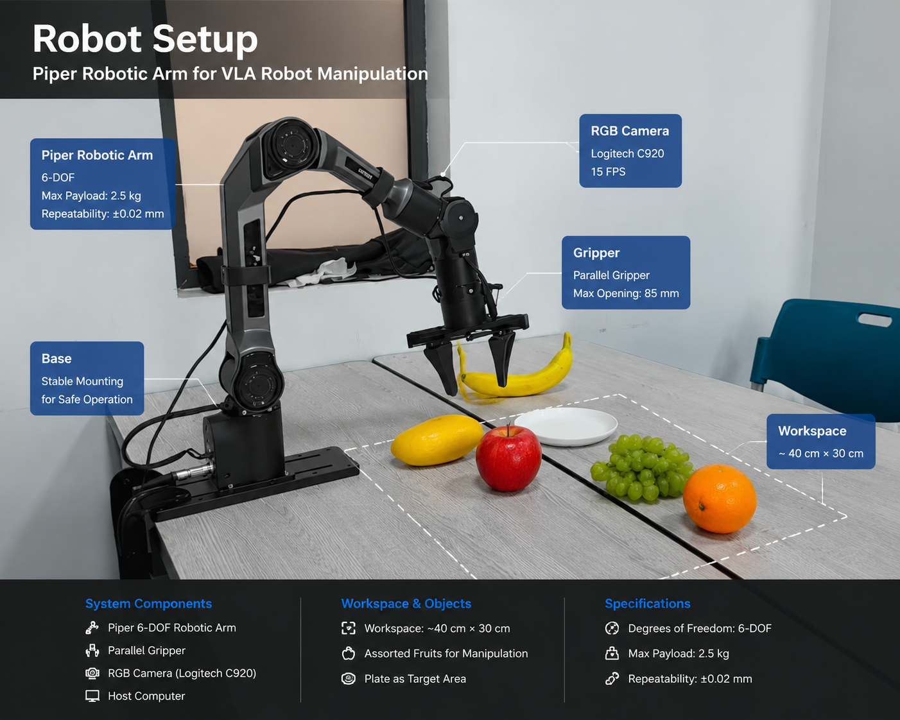
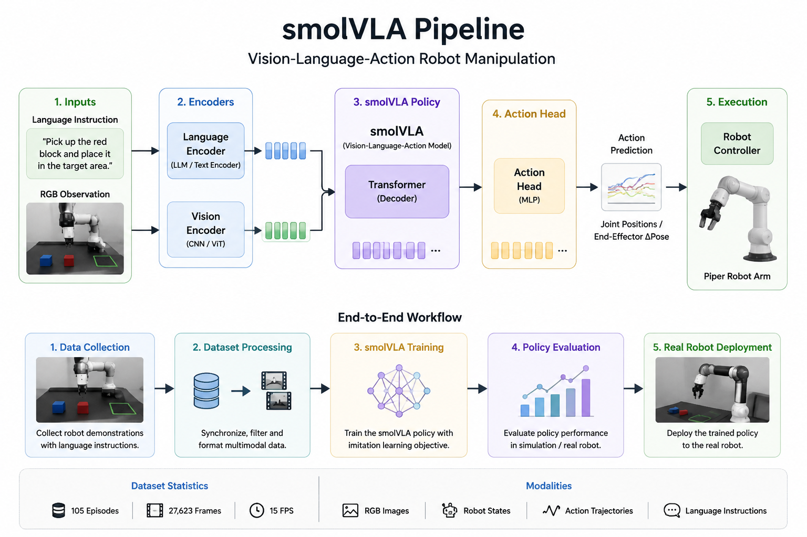

# smolVLA-robot-manipulation

A Vision-Language-Action (VLA) robot manipulation project based on smolVLA.
This project builds an end-to-end robot learning pipeline, including robot demonstration collection, dataset processing, VLA policy training and real-world robot deployment.

## 🎥 Real Robot Demo

## 🤖 Robot Setup

## 🚀 Training Pipeline

## 🧠 Overview
Vision-Language-Action models enable robots to understand visual observations and language instructions, then generate corresponding robot actions.
This project explores how smolVLA can be applied to real-world robot manipulation tasks.
Pipeline:
Language Instruction
↓
RGB Observation
↓
smolVLA Policy
↓
Action Prediction
↓
Robot Execution

## 🤖 Hardware
Robot Platform:
- Piper robotic arm
Sensors:
- RGB camera

## 📊 Dataset
Dataset collected from real robot demonstrations.
Scale:
- 105 episodes
- 27623 frames
- 15FPS
Modalities:
- RGB images
- Robot states
- Action trajectories
- Language instructions

## 🚀 Training Pipeline
The complete workflow:
Robot Demonstration Collection
↓
Dataset Processing
↓
smolVLA Training
↓
Policy Evaluation
↓
Real Robot Deployment

## 🔥 Project Highlights
- Built a complete Vision-Language-Action robot learning pipeline
- Processed real robot demonstration data
- Trained VLA policy for manipulation tasks
- Deployed learned policy on physical robot platform

## 🛠️ Technologies
Robot Learning:
- Vision-Language-Action (VLA)
- Imitation Learning
- Robot Manipulation
Framework:
- LeRobot
- PyTorch
Robot:
- Piper Robot Arm

## 📁 Repository Structure
smolVLA-robot-manipulation

├── README.md

├── assets
│ ├── pipeline.png
│ ├── robot_setup.jpg
│ └── demo.gif

├── configs

├── scripts
│ ├── train.sh
│ └── inference.sh

├── examples
│ └── inference_demo.py

├── docs
│ ├── training.md
│ └── deployment.md

└── results
└── videos

## 📌 Future Work
- Add robot execution videos
- Release training configuration
- Improve policy evaluation
- Add simulation experiments

## 📬 Contact
Chen Fei
Email:HUAWEI260421@outlook.com
